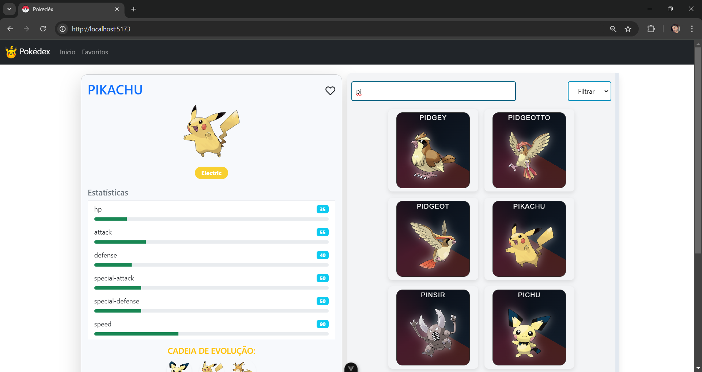
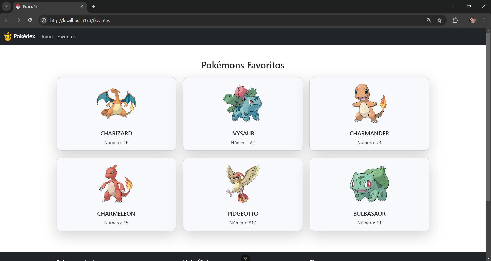

# Pokébex

## Descrição

Pokédex é uma aplicação web que funciona como uma Pokédex, permitindo aos usuários pesquisar, visualizar e filtrar informações sobre os Pokémon. A aplicação utiliza a PokeAPI para obter dados sobre os Pokémon.

## 📌Tecnologias Utilizadas

- **Vue.js**: Framework JavaScript para construir interfaces de usuário.
- **Vite**: Ferramenta de build rápida para aplicações web.
- **Bootstrap**: Framework CSS para estilização responsiva.
- **TypeScript**: Superset do JavaScript que adiciona tipagem estática.
- **Vitest**: Framework de testes para o Vue.
- **Vue Test Utils**: Biblioteca oficial para testar componentes Vue.

## 🚧 Status do Projeto

### Atualmente, o progresso da aplicação é:

- Já foi realizada a organização do layout principal, incluindo o header e o footer, e a renderização desses componentes foi testada.
- Os Pokémon já estão sendo listados com nome e foto.
- Foram realizados testes de renderização para garantir que os Pokémon foram carregados na tela, testes para verificar se, ao clicar, o estado global é preenchido, e testes end-to-end para confirmar se o Pokémon é renderizado corretamente no card ao ser clicado.
- As funcionalidades de **busca por nome** e **filtro por tipo** foram implementadas e testadas com sucesso.
- Agora, o usuário pode **salvar Pokémon como favoritos** ao visualizar mais informações de um Pokémon específico.

## 🧩 Instalação

1. Clone o repositório:

   ```bash
   git clone https://github.com/devluanpaiva/pokedex.git

   ```

2. Navegue até o diretório:

```sh
cd pokedex

```

3. Instale as dependências:

```bash
npm install
# ou
yarn install
```

4. Inicie o servidor de desenvolvimento:
   ```bash
   npm run dev
   # or
   yarn dev
   # or
   pnpm dev
   # or
   bun dev
   ```
5. Abra o navegador e acesse `http://localhost::5173`.

##🔬 Testes

### Teste a aplicação com [Vitest](https://vitest.dev/)

```sh
npm run test:unit
```

### Rode testes End-to-End com [Cypress](https://www.cypress.io/)

```sh
npm run test:e2e:dev
```

Isso executa os testes ponta a ponta no servidor de desenvolvimento Vite.
É muito mais rápido que a construção de produção.

Mas ainda é recomendado testar a compilação de produção com `test:e2e` antes da implantação (por exemplo, em ambientes de CI):

```sh
npm run build
npm run test:e2e
```

### Lint com [ESLint](https://eslint.org/)

```sh
npm run lint
```

## 📚 Tutorial de Uso

Ao acessar a aplicação Pokédex, você será apresentado a uma lista de 300 Pokémon, exibindo seus nomes e imagens. Aqui está um guia rápido sobre como usar a aplicação:

1. **Listagem de Pokémon**:

   - Assim que você entrar no sistema, verá uma lista de Pokémon. Cada Pokémon é apresentado com sua imagem e nome.

2. **Visualizando Detalhes de um Pokémon**:

   - Para saber mais sobre um Pokémon, basta clicar em sua imagem ou nome.
   - Ao lado da lista, um card aparecerá mostrando informações detalhadas sobre o Pokémon selecionado, incluindo:
     - **Nome**
     - **Imagem**
     - **Estatísticas**:
       - HP
       - Attack
       - Defense
       - Special Attack
       - Special Defense
       - Speed
     - **Tipos**: Os tipos do Pokémon são exibidos com as cores correspondentes.
     - **Evoluções**: A cadeia de evolução é apresentada com imagens e nomes.

3. **Busca por Nome**:

   - Acima da lista de Pokémon, você encontrará um campo de busca.
   - Digite o nome do Pokémon desejado nesse campo. A cada letra digitada, a lista será filtrada automaticamente para exibir apenas os Pokémon que correspondem ao texto inserido.

4. **Filtro por Tipo**:

   - Ao lado do campo de busca, há um dropdown para filtro.
   - Clique no dropdown para selecionar um ou mais tipos (como água, fogo, grama, etc.).
   - Ao escolher um tipo, a lista de Pokémon será atualizada para mostrar apenas aqueles que correspondem ao tipo selecionado.

5. **Favoritar Pokémon**:
   - Na parte superior direita do card de detalhes, há um **ícone de coração**.
   - Ao clicar nesse ícone, o Pokémon será **salvo como favorito**.
   - Para acessar a lista de Pokémon favoritos, basta clicar em **"Favoritos"** no menu de navegação no cabeçalho.

Siga essas instruções para explorar e encontrar informações sobre seus Pokémon favoritos de maneira fácil e rápida!

## 🖼️ Exemplos da Interface

### Listagem de Pokémon


### Pokémons Favoritos



## ✍️ Contribuições

Sinta-se à vontade para contribuir com este projeto. Sugestões, correções de bugs e melhorias são sempre bem-vindas. Por favor, siga o fluxo de trabalho do Git Flow para submissão de pull requests.

## 🔗 Créditos

A inspiração para o desenvolvimento deste projeto veio da playlist, [PokeVite - Curso Vue 3 + Vite](https://www.youtube.com/playlist?list=PLygIEirBzJi64nSpsN1S6varBLU0HckAF).
